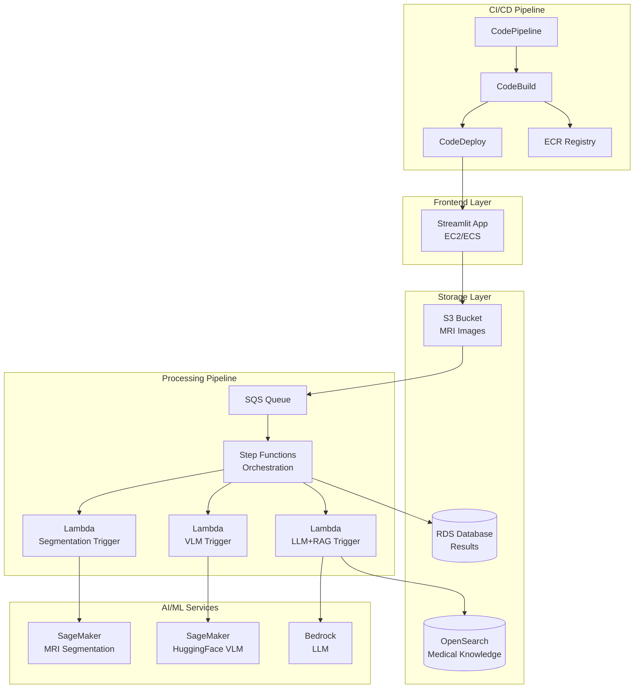

# Healthcare Image Analysis System Design

## Overview

This document outlines the architectural design for a healthcare image analysis system that processes MRI images through a multi-stage AI pipeline on AWS. The system uses event-driven architecture with serverless components to automatically process uploaded MRI images through segmentation, image-to-text conversion, and LLM-enhanced analysis.

## Architecture

### High-Level Architecture

The system follows a microservices architecture pattern with event-driven processing:



### Event-Driven Processing Flow

1. **Upload Trigger**: S3 event notification triggers SQS message
2. **Orchestration**: Step Functions coordinates the multi-stage pipeline
3. **Sequential Processing**: Each AI model processes results from the previous stage
4. **Result Storage**: Final results stored in RDS with metadata

## Components and Interfaces

### Frontend Component (Streamlit Application)

**Technology**: Streamlit on ECS Fargate or EC2
**Responsibilities**:
- File upload interface for MRI images
- Job status tracking and progress display
- Results visualization and download
- User authentication and session management

**Interfaces**:
- REST API endpoints for file upload
- WebSocket connections for real-time status updates
- S3 SDK for direct file uploads with presigned URLs

### Storage Components

#### S3 Bucket Configuration
```yaml
Buckets:
  - Name: healthcare-mri-images
    Versioning: Enabled
    Encryption: AES-256
    Lifecycle: 
      - DeleteAfter: 90 days (processed images)
      - TransitionToIA: 30 days
  
  - Name: healthcare-processed-results
    Versioning: Enabled
    Encryption: AES-256
```

#### RDS Database Schema
```sql
-- Jobs tracking table
CREATE TABLE analysis_jobs (
    job_id UUID PRIMARY KEY,
    user_id VARCHAR(255),
    original_image_key VARCHAR(500),
    status ENUM('uploaded', 'segmenting', 'converting', 'enhancing', 'completed', 'failed'),
    created_at TIMESTAMP,
    updated_at TIMESTAMP,
    error_message TEXT
);

-- Results storage table
CREATE TABLE analysis_results (
    result_id UUID PRIMARY KEY,
    job_id UUID REFERENCES analysis_jobs(job_id),
    segmentation_result_key VARCHAR(500),
    image_description TEXT,
    enhanced_report TEXT,
    confidence_scores JSON,
    processing_metrics JSON,
    created_at TIMESTAMP
);
```

### Processing Pipeline Components

#### Step Functions State Machine
```json
{
  "Comment": "MRI Image Analysis Pipeline",
  "StartAt": "SegmentImage",
  "States": {
    "SegmentImage": {
      "Type": "Task",
      "Resource": "arn:aws:states:::lambda:invoke",
      "Parameters": {
        "FunctionName": "mri-segmentation-trigger"
      },
      "Next": "ImageToText",
      "Catch": [{"ErrorEquals": ["States.ALL"], "Next": "HandleError"}]
    },
    "ImageToText": {
      "Type": "Task",
      "Resource": "arn:aws:states:::lambda:invoke",
      "Parameters": {
        "FunctionName": "vlm-processing-trigger"
      },
      "Next": "EnhanceWithLLM",
      "Catch": [{"ErrorEquals": ["States.ALL"], "Next": "HandleError"}]
    },
    "EnhanceWithLLM": {
      "Type": "Task",
      "Resource": "arn:aws:states:::lambda:invoke",
      "Parameters": {
        "FunctionName": "llm-rag-enhancement"
      },
      "Next": "StoreResults",
      "Catch": [{"ErrorEquals": ["States.ALL"], "Next": "HandleError"}]
    },
    "StoreResults": {
      "Type": "Task",
      "Resource": "arn:aws:states:::lambda:invoke",
      "Parameters": {
        "FunctionName": "store-analysis-results"
      },
      "End": true
    },
    "HandleError": {
      "Type": "Task",
      "Resource": "arn:aws:states:::lambda:invoke",
      "Parameters": {
        "FunctionName": "error-handler"
      },
      "End": true
    }
  }
}
```

#### Lambda Functions

**1. MRI Segmentation Trigger**
- Invokes SageMaker endpoint for MRI segmentation
- Handles model input/output formatting
- Updates job status in RDS

**2. VLM Processing Trigger**
- Calls HuggingFace model on SageMaker
- Converts segmented images to descriptive text
- Passes results to next stage

**3. LLM+RAG Enhancement**
- Queries OpenSearch for relevant medical knowledge
- Calls Bedrock LLM with RAG context
- Generates comprehensive medical report

**4. Results Storage Handler**
- Stores final results in RDS
- Updates job status to completed
- Triggers user notifications

### AI/ML Model Components

#### SageMaker Endpoints

**MRI Segmentation Model**:
```python
# Model configuration
{
    "ModelName": "mri-segmentation-model",
    "PrimaryContainer": {
        "Image": "763104351884.dkr.ecr.us-east-1.amazonaws.com/pytorch-inference:1.12.0-gpu-py38",
        "ModelDataUrl": "s3://model-artifacts/mri-segmentation/model.tar.gz"
    },
    "ExecutionRoleArn": "arn:aws:iam::account:role/SageMakerExecutionRole"
}
```

**HuggingFace VLM Model**:
```python
# HuggingFace model configuration
{
    "ModelName": "huggingface-vlm-model",
    "PrimaryContainer": {
        "Image": "763104351884.dkr.ecr.us-east-1.amazonaws.com/huggingface-pytorch-inference:1.13.1-transformers4.26.0-gpu-py39-cu117-ubuntu20.04",
        "Environment": {
            "HF_MODEL_ID": "microsoft/BiomedCLIP-PubMedBERT_256-vit_base_patch16_224",
            "HF_TASK": "image-to-text"
        }
    }
}
```

#### Bedrock LLM Integration
```python
# Bedrock client configuration
bedrock_client = boto3.client(
    'bedrock-runtime',
    region_name='us-east-1'
)

# RAG-enhanced prompt template
prompt_template = """
Based on the medical image analysis: {image_description}

Relevant medical knowledge from database:
{rag_context}

Please provide a comprehensive medical analysis report including:
1. Key findings
2. Clinical significance
3. Recommended follow-up actions
4. Confidence assessment
"""
```

## Data Models

### Job Processing Model
```python
from dataclasses import dataclass
from enum import Enum
from datetime import datetime
from typing import Optional, Dict, Any

class JobStatus(Enum):
    UPLOADED = "uploaded"
    SEGMENTING = "segmenting"
    CONVERTING = "converting"
    ENHANCING = "enhancing"
    COMPLETED = "completed"
    FAILED = "failed"

@dataclass
class AnalysisJob:
    job_id: str
    user_id: str
    original_image_key: str
    status: JobStatus
    created_at: datetime
    updated_at: datetime
    error_message: Optional[str] = None
    
@dataclass
class ProcessingResult:
    result_id: str
    job_id: str
    segmentation_result_key: str
    image_description: str
    enhanced_report: str
    confidence_scores: Dict[str, float]
    processing_metrics: Dict[str, Any]
    created_at: datetime
```

### Model Input/Output Schemas
```python
# MRI Segmentation Input
@dataclass
class SegmentationInput:
    image_s3_key: str
    output_format: str = "nifti"
    
# VLM Input
@dataclass
class VLMInput:
    segmented_image_s3_key: str
    prompt: str = "Describe the medical findings in this MRI image"
    
# LLM Enhancement Input
@dataclass
class LLMInput:
    image_description: str
    rag_context: str
    model_id: str = "anthropic.claude-3-sonnet-20240229-v1:0"
```

## Error Handling

### Error Categories and Responses

1. **Upload Errors**
   - Invalid file format → User notification with supported formats
   - File size exceeded → User notification with size limits
   - S3 upload failure → Retry mechanism with exponential backoff

2. **Processing Errors**
   - Model endpoint unavailable → Circuit breaker pattern with fallback
   - Timeout errors → Configurable timeout with retry logic
   - Memory/compute errors → Auto-scaling and resource monitoring

3. **Data Errors**
   - Database connection failures → Connection pooling and retry logic
   - Data corruption → Validation checks and rollback mechanisms
   - OpenSearch query failures → Fallback to cached results

### Error Recovery Strategies
```python
# Retry configuration
RETRY_CONFIG = {
    "max_attempts": 3,
    "backoff_multiplier": 2,
    "initial_delay": 1,
    "max_delay": 60
}

# Circuit breaker for model endpoints
CIRCUIT_BREAKER_CONFIG = {
    "failure_threshold": 5,
    "recovery_timeout": 300,
    "expected_exception": ModelEndpointException
}
```

## Testing Strategy

### Unit Testing
- Lambda function logic testing
- Data model validation testing
- API endpoint testing
- Database operation testing

### Integration Testing
- End-to-end pipeline testing with sample MRI images
- AWS service integration testing
- Error handling and recovery testing
- Performance and load testing

### Model Testing
- Model accuracy validation with medical datasets
- A/B testing for model improvements
- Bias and fairness testing for healthcare applications
- Regression testing for model updates

### Security Testing
- Penetration testing for web application
- Data encryption validation
- IAM policy testing
- Compliance validation (HIPAA, SOC 2)

## CI/CD Pipeline Design

### CodePipeline Stages

1. **Source Stage**
   - GitHub repository trigger
   - Artifact creation and versioning

2. **Build Stage (CodeBuild)**
   - Unit test execution
   - Docker image building
   - Security scanning
   - Artifact packaging

3. **Deploy Stage (CodeDeploy)**
   - Blue/green deployment for ECS services
   - Lambda function updates
   - Database migration execution
   - Health check validation

### Build Specification
```yaml
# buildspec.yml
version: 0.2
phases:
  pre_build:
    commands:
      - echo Logging in to Amazon ECR...
      - aws ecr get-login-password --region $AWS_DEFAULT_REGION | docker login --username AWS --password-stdin $AWS_ACCOUNT_ID.dkr.ecr.$AWS_DEFAULT_REGION.amazonaws.com
  build:
    commands:
      - echo Build started on `date`
      - echo Building the Docker image...
      - docker build -t $IMAGE_REPO_NAME:$IMAGE_TAG .
      - docker tag $IMAGE_REPO_NAME:$IMAGE_TAG $AWS_ACCOUNT_ID.dkr.ecr.$AWS_DEFAULT_REGION.amazonaws.com/$IMAGE_REPO_NAME:$IMAGE_TAG
  post_build:
    commands:
      - echo Build completed on `date`
      - echo Pushing the Docker image...
      - docker push $AWS_ACCOUNT_ID.dkr.ecr.$AWS_DEFAULT_REGION.amazonaws.com/$IMAGE_REPO_NAME:$IMAGE_TAG
artifacts:
  files:
    - '**/*'
```

This design provides a comprehensive, scalable, and secure architecture for your healthcare image analysis system using AWS services with proper CI/CD integration.